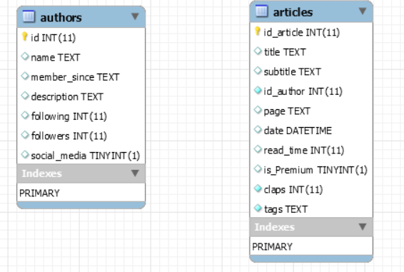

"# KippaTeam" 

This is our program. We import different information from the website: Toward Data Science (https://towardsdatascience.com/)
The first dataframe is the basics information from the home page of each topic (Data Science, AI, Programming, ...)
The second dataframe is the authors of each articles, we have the names of the authors, the date of subscription, the
number of followers et followings and if he has social media
The third dataframe is the articles details. It gives additional information about the articles like claps and tags

The final objective is to analyse these data.

Enjoy.

<b> To do list </b>

<b>CHECKPOINT 1</b>

1. Chose a topic - done

2. Initially chose pintrest however we were not happy with the data that we were
able to scrape. On consultation with Danielle we changed to towardsdatascience.com
which we confirmed had sufficient data

3. Read throuhg tutorial about requests - done

4. Read through tutorial about - done

5. Code webscraper - 1/2 done
	- Our main scraper is working. Scraping data of all the articles on the
	site. We just need to finish our scraper for the authors.

6. Only use requests, beautiful and selenium - done

Stuff ont the drive:
- scrape data source - mostly done
- pep8 - not done
- source control - ongoing
- software design - not done

<b>CHECKPOINT 2</b>

1. Command line interface
- Wrap up your web scraper to be able to call it with different arguments from the
terminal. </b>Done.</b>
- Use click or argparse packages. <b>Done.</b>
2. Database implementation
- Design an ERD for your data. Think about which fields should be primary and foreign
keys, and how you distinct new entries from already existing ones. </b> Done. </b>
>>>>>>> master

- Take notice to primary and foreign keys. </b>Done.</b>
- Write a script that creates your database structure (python or sql), it should be separate
    from the main scraper code (but should be part of the project and submitted as well). </b>Done.</b>
- Add to your scraper the ability to store the data it scrapes to the database you designed.
    It should store only new data and avoid duplicates. </b>Done.</b>
=======
from the main scraper code (but should be part of the project and submitted as well). </b>Done.</b>
- Add to your scraper the ability to store the data it scrapes to the database you designed.
It should store only new data and avoid duplicates. </b>Done.</b>
